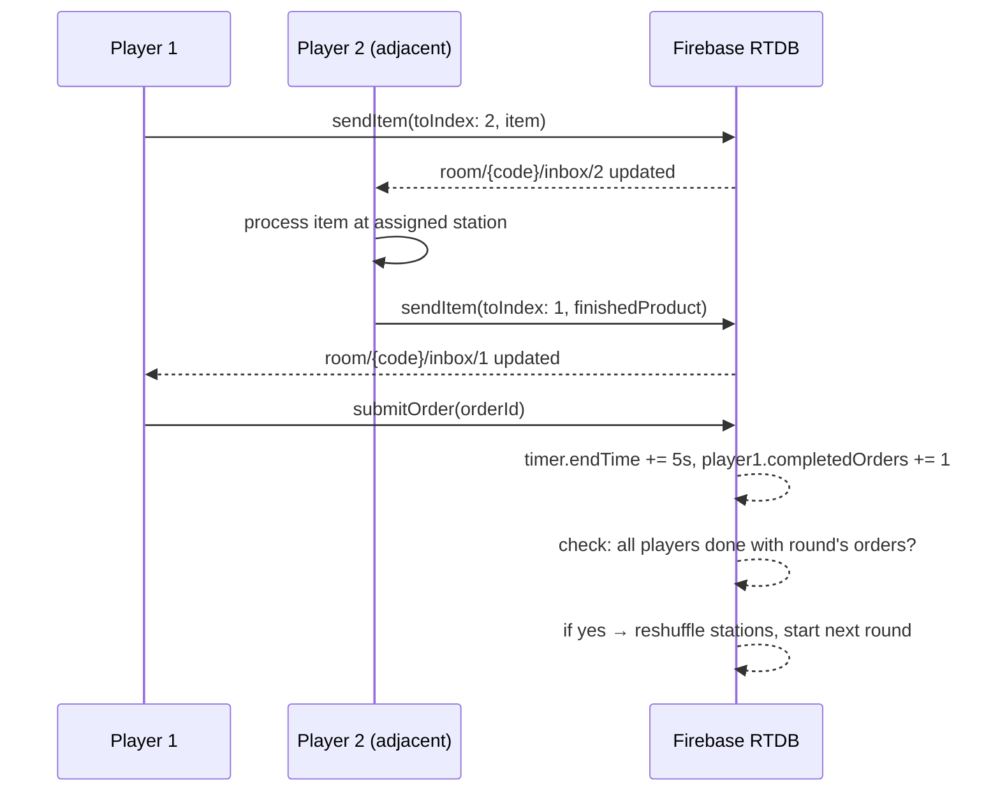
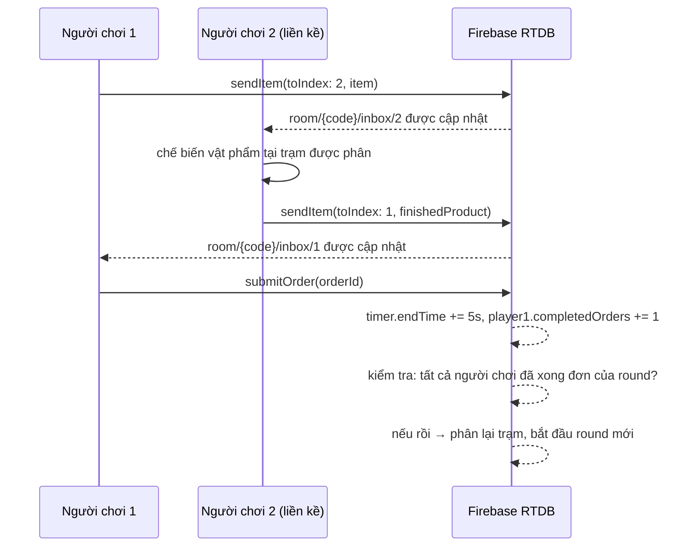

# ARCHITECTURE — game_kitchen (Bartender)

## English

### Position in the app
Unlike an earlier plan that assumed a `packages/` monorepo with a shared `MiniGame` plugin interface, the actual repo (`Game_Bartender`) uses a **flat structure**: every game lives directly under `lib/games/<name>/`, and the lobby screen imports and navigates to each game's entry screen directly. This mirrors `lib/games/rubik/` exactly.

```dart
// lib/screens/home/lobby_screen.dart (existing file, shared)
_game(
  LobbyLayout.bartender,
  'Quầy Bartender',
  onBartenderTap ?? () => Navigator.of(context).push(
    MaterialPageRoute<void>(builder: (_) => const BartenderScreen()),
  ),
),
```
`BartenderScreen` (in `lib/games/bartender/screens/`) is the single entry point this feature exposes to the rest of the app — everything else in `lib/games/bartender/` is private to this feature and not imported from outside it.

### Internal layers
Inside `lib/games/bartender/`, the same three-layer split from the original plan is kept — it is an internal convention of this feature, not something the rest of the repo enforces, but it keeps gameplay logic testable and keeps the backend swappable.

```
lib/games/bartender/
├── models/        # Pure Dart — no Flutter, no Firebase imports
│                   # Player, Room, Order, Recipe, Station, Round, ring math
├── services/
│   ├── room_repository.dart          # Abstract interface
│   ├── firebase_room_repository.dart # Real implementation (RTDB)
│   └── fake_room_repository.dart     # In-memory implementation for local dev
├── controllers/   # Round/timer state management — reads/writes via RoomRepository,
│                   # exposes state to widgets (similar role to game_kitchen's old
│                   # "domain/rules" + Rubik's CubeInputController pattern)
├── widgets/        # Station widgets, swipe targets, trash bin, order tray
└── screens/         # BartenderScreen, lobby/waiting, match, results
```

This follows the naming style already used by `lib/games/rubik/` (`models/`, `services/`, `controllers/`, `widgets/`, `screens/`) rather than the earlier `domain/data/presentation` naming, so the two features read consistently to anyone browsing the repo.

**`models/`** contains the game rules described in `PROJECT_SPEC.md`: ring position math (`(index ± 1) mod playerCount`), round completion checks, station reassignment, recipe/difficulty selection, and timer bonus rules — plain Dart, unit-testable without a device or emulator, same as Rubik's `CubeState`/`CubeValidationService`.

**`services/`** exposes one interface, `RoomRepository`, with methods such as `createRoom()`, `joinRoom(code)`, `submitOrder(...)`, `sendItem(...)`, `watchRoom(code)` (a stream of room state). Two implementations exist, same reasoning as Rubik keeping scanning and solving behind interfaces (`CubeScanner`, `CubeSolver`):
- `FakeRoomRepository` — in-memory, used for early development and testing without any backend.
- `FirebaseRoomRepository` — talks to Firebase Realtime Database for real multi-device play.

**`controllers/`** and **`widgets/`/`screens/`** only depend on `models/` and the `RoomRepository` interface — never directly on Firebase. Switching backend later only requires a new `services/` implementation, not a UI rewrite.

### Data flow (per round)



### Firebase Realtime Database usage
- No other feature in this repo uses Firebase yet (`pubspec.yaml` currently has no `firebase_*` packages) — this feature will be the first to add it. Flag this to the team so adding the Firebase config files doesn't surprise anyone touching `android/`/`ios/`.
- Chosen because it requires no backend server, has a free tier well above this project's expected load, and has first-class Flutter support (FlutterFire).
- The shared timer is synced as an absolute `endTime` timestamp (not a per-second countdown stream), with each client computing remaining time locally and correcting for clock drift using Firebase's `.info/serverTimeOffset`.
- Item passing uses a small per-player "inbox" node so each client only listens to its own inbox, not the whole room state.
- Full schema is documented in `API.md`.

### Technologies
| Concern | Choice | Why |
|---|---|---|
| UI framework | Flutter | Fixed by the overall project |
| Realtime sync | Firebase Realtime Database | No server to host/maintain, free tier is enough, good Flutter support, first feature to add it |
| Shake detection | `sensors_plus` | Standard, well-documented Flutter package, not yet in `pubspec.yaml` |
| Haptics | `HapticFeedback` (Flutter built-in) or `vibration` package | Simple event-based feedback |

### Trade-offs
- **No authoritative server:** game logic runs on each client; Firebase Security Rules provide only basic write validation, not full anti-cheat. Accepted because this is a student demo, not a public game.
- **RTDB over Firestore:** lower latency for frequent small updates (item passing), free tier billed by connections/bandwidth rather than per operation.
- **Round model adds a second piece of state on top of the shared timer:** explicit request from the team lead so future updates (harder rounds, more mechanics) can extend round logic without touching match-ending timer logic.
- **Duplicate/missing station assignment kept even at 2–4 players:** intentionally keeps the "sometimes you have no station and must rely on teammates" tension from the original design.
- **Touching `lobby_screen.dart`:** this is the one place this feature's code reaches outside `lib/games/bartender/`. Keep that change to the single line wiring `onBartenderTap`, done as its own small, clearly-labeled commit/PR, so the leader can review it in isolation from the rest of the feature's code.

## Tiếng Việt

### Vị trí trong app
Khác với kế hoạch trước đó giả định có `packages/` monorepo với interface plugin `MiniGame` dùng chung, repo thật (`Game_Bartender`) dùng **cấu trúc phẳng**: mỗi game nằm trực tiếp trong `lib/games/<name>/`, và lobby import và điều hướng thẳng đến màn hình vào của từng game. Giống hệt `lib/games/rubik/`.

```dart
// lib/screens/home/lobby_screen.dart (file có sẵn, dùng chung)
_game(
  LobbyLayout.bartender,
  'Quầy Bartender',
  onBartenderTap ?? () => Navigator.of(context).push(
    MaterialPageRoute<void>(builder: (_) => const BartenderScreen()),
  ),
),
```
`BartenderScreen` (trong `lib/games/bartender/screens/`) là điểm vào duy nhất mà tính năng này lộ ra cho phần còn lại của app — mọi thứ khác trong `lib/games/bartender/` là riêng tư, không được import từ bên ngoài.

### Các lớp nội bộ
Bên trong `lib/games/bartender/`, vẫn giữ cách chia 3 lớp từ kế hoạch gốc — đây là quy ước nội bộ của tính năng này, không phải thứ phần còn lại của repo bắt buộc, nhưng giúp logic gameplay test được và backend thay đổi được sau này.

```
lib/games/bartender/
├── models/        # Dart thuần — không import Flutter, không import Firebase
│                   # Player, Room, Order, Recipe, Station, Round, toán vòng tròn
├── services/
│   ├── room_repository.dart          # Interface trừu tượng
│   ├── firebase_room_repository.dart # Bản thật (RTDB)
│   └── fake_room_repository.dart     # Bản trong bộ nhớ, dùng để dev local
├── controllers/   # Quản lý trạng thái round/đồng hồ — đọc/ghi qua RoomRepository,
│                   # lộ trạng thái cho widget (vai trò tương tự "domain/rules" cũ
│                   # và CubeInputController bên Rubik)
├── widgets/        # Widget trạm, vùng vuốt, thùng rác, khay đơn hàng
└── screens/         # BartenderScreen, lobby/chờ, trận đấu, kết quả
```

Cách này theo đúng kiểu đặt tên mà `lib/games/rubik/` đã dùng (`models/`, `services/`, `controllers/`, `widgets/`, `screens/`) thay vì cách gọi `domain/data/presentation` trước đó, để hai tính năng đọc nhất quán với bất kỳ ai duyệt qua repo.

**`models/`** chứa các luật chơi đã mô tả trong `PROJECT_SPEC.md`: toán vị trí vòng tròn (`(index ± 1) mod playerCount`), kiểm tra round hoàn thành, phân lại trạm, chọn công thức/độ khó, và luật cộng thời gian — Dart thuần, unit-test được mà không cần thiết bị hay giả lập, giống cách `CubeState`/`CubeValidationService` của Rubik.

**`services/`** cung cấp một interface, `RoomRepository`, với các phương thức như `createRoom()`, `joinRoom(code)`, `submitOrder(...)`, `sendItem(...)`, `watchRoom(code)` (một stream trạng thái phòng). Có hai bản triển khai, cùng tinh thần với việc Rubik giữ scan và giải sau interface (`CubeScanner`, `CubeSolver`):
- `FakeRoomRepository` — trong bộ nhớ, dùng cho giai đoạn phát triển đầu và test mà không cần backend.
- `FirebaseRoomRepository` — giao tiếp với Firebase Realtime Database cho chơi thật nhiều thiết bị.

**`controllers/`** và **`widgets/`/`screens/`** chỉ phụ thuộc `models/` và interface `RoomRepository` — không bao giờ phụ thuộc trực tiếp Firebase. Đổi backend sau này chỉ cần thêm bản triển khai `services/` mới, không phải viết lại giao diện.

### Luồng dữ liệu (theo từng round)



### Dùng Firebase Realtime Database
- Chưa tính năng nào khác trong repo dùng Firebase (`pubspec.yaml` hiện chưa có package `firebase_*` nào) — tính năng này sẽ là tính năng đầu tiên thêm vào. Báo trước cho nhóm để việc thêm file cấu hình Firebase không gây bất ngờ cho ai đụng vào `android/`/`ios/`.
- Được chọn vì không cần server backend, gói miễn phí đủ dùng cho tải dự kiến, và hỗ trợ Flutter tốt (FlutterFire).
- Đồng hồ chung đồng bộ dưới dạng mốc thời gian tuyệt đối `endTime` (không phải stream đếm từng giây), mỗi client tự tính thời gian còn lại và bù lệch giờ bằng `.info/serverTimeOffset` của Firebase.
- Chuyền vật phẩm dùng node "inbox" riêng cho từng người, mỗi client chỉ lắng nghe hộp thư của mình, không phải toàn bộ trạng thái phòng.
- Schema đầy đủ trong `API.md`.

### Công nghệ sử dụng
| Vấn đề | Lựa chọn | Vì sao |
|---|---|---|
| Framework giao diện | Flutter | Đã cố định theo dự án chung |
| Đồng bộ thời gian thực | Firebase Realtime Database | Không cần host/bảo trì server, gói miễn phí đủ dùng, hỗ trợ Flutter tốt, tính năng đầu tiên thêm vào |
| Nhận diện lắc | `sensors_plus` | Package Flutter chuẩn, tài liệu đầy đủ, chưa có trong `pubspec.yaml` |
| Rung phản hồi | `HapticFeedback` (có sẵn trong Flutter) hoặc package `vibration` | Phản hồi theo sự kiện đơn giản |

### Đánh đổi
- **Không có server authoritative:** logic game chạy trên từng client; Firebase Security Rules chỉ kiểm tra ghi cơ bản, không chống gian lận hoàn toàn. Chấp nhận được vì đây là demo đồ án.
- **RTDB thay vì Firestore:** độ trễ thấp hơn cho cập nhật nhỏ, thường xuyên; gói miễn phí tính theo kết nối/băng thông thay vì theo thao tác.
- **Mô hình round thêm một lớp trạng thái nữa:** yêu cầu rõ ràng từ leader, để bản cập nhật sau mở rộng được logic round mà không đụng logic kết thúc trận.
- **Giữ thiếu/trùng trạm dù chỉ 2-4 người:** cố ý giữ tinh thần "đôi khi không có trạm, phải dựa đồng đội" của thiết kế gốc.
- **Đụng vào `lobby_screen.dart`:** đây là chỗ duy nhất code của tính năng này vươn ra ngoài `lib/games/bartender/`. Giữ thay đổi đó chỉ ở đúng một dòng nối `onBartenderTap`, làm thành một commit/PR riêng, rõ ràng, để leader review tách biệt với phần còn lại của tính năng.
